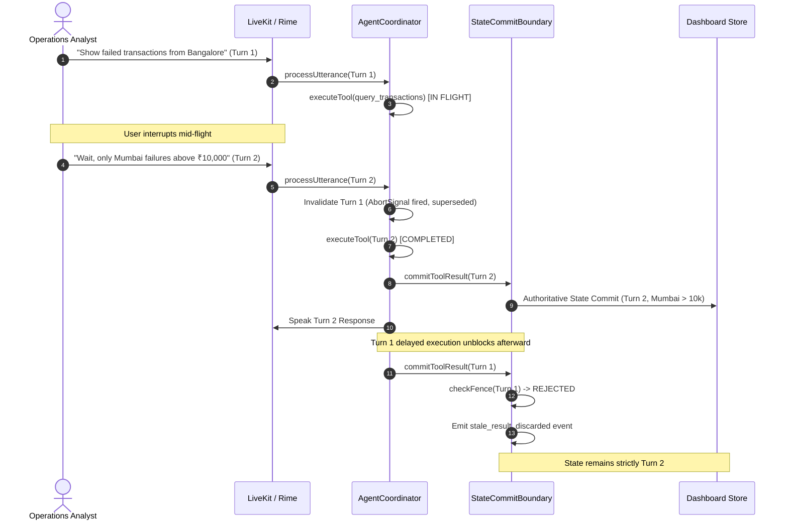

# VoiceOps Evaluation & Verification Framework

This document outlines the evaluation infrastructure, test suites, and turn-fencing verification architecture for the VoiceOps voice-native copilot.

---

## 1. Overview & Architecture

VoiceOps handles conversational analytics over high-velocity transaction streams. The central technical challenge in voice-native interfaces is **interruption and state recovery** (barge-in):



---

## 2. Test Suite Directory Structure

```
tests/
├── interruption/
│   ├── turn_sequencing.test.ts   # Lifecycle, superseding, cascades, AbortSignal
│   ├── stale_result_race.test.ts  # Deterministic primary hackathon race condition test
│   ├── stress.test.ts             # 20-iteration repeatable race stress test
│   └── telemetry.test.ts          # Structured events, latency tracker, secret sanitization
├── data/
│   └── query_engine.test.ts       # Synthetic data query filtering, metrics & limits
├── state/
│   └── dashboard_state.test.ts    # Frontend Zustand store turnId fence validation
├── contracts/
│   └── contracts.test.ts          # Cross-package schemas, turnId propagation & types
├── fixtures/
│   ├── deterministic_data.ts      # Fixed seed datasets without Math.random()
│   └── telemetry_helpers.ts       # Monotonic latency tracking & cutoff calculation
└── e2e/
    └── dashboard_simulation.test.ts # Simulated full lifecycle (load -> query -> barge-in -> verify)
```

---

## 3. Verification Commands

All tests use the native Node.js test runner (`node:test`) and TypeScript compiler:

```bash
# Full Verification Suite
npm test

# Fast Interruption State Tests
npm run test:interruption

# Interruption Stress Test
npm run test:stress

# Integration Contract Verification
npm run test:contracts

# Typecheck All Workspaces
npm run typecheck

# Monorepo Build
npm run build
```

---

## 4. Observability & Telemetry Specifications

The `EventLogger` records structured telemetry for every turn event:

| Event Type | Key Payload Fields | Description |
|---|---|---|
| `turn_created` | `turnId`, `requestId`, `userUtterance` | Emitted on new turn initiation |
| `turn_interrupted` | `turnId`, `requestId`, `supersededByTurnId`, `reason` | Emitted on barge-in |
| `tool_started` | `turnId`, `requestId`, `toolName`, `args` | Emitted when tool begins |
| `tool_completed` | `turnId`, `requestId`, `toolName`, `durationMs` | Emitted on tool completion |
| `tool_aborted` | `turnId`, `requestId`, `toolName`, `reason` | Emitted if tool aborted |
| `stale_result_discarded` | `turnId`, `requestId`, `authoritativeTurnId`, `discardReason` | Emitted when fence blocks stale commit |
| `state_commit` | `turnId`, `requestId`, `toolName`, `matchingCount`, `filters` | Emitted on valid state update |
| `response_generated` | `turnId`, `requestId`, `spokenText` | Emitted for authoritative voice response |
